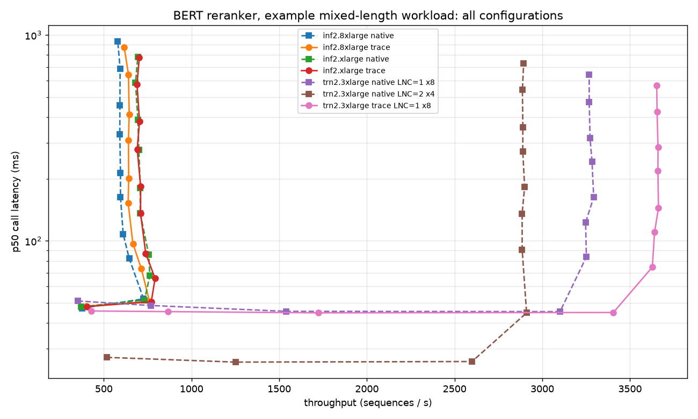

# BERT Reranker on AWS Neuron

Deployment and benchmarking of
[`Alibaba-NLP/gte-multilingual-reranker-base`](https://huggingface.co/Alibaba-NLP/gte-multilingual-reranker-base)
(~306M parameter, 12-layer cross-encoder reranker) on AWS Inferentia2 and Trainium2.

Every number in this directory is a **hardware measurement**. Nothing is estimated,
extrapolated, or simulated.

## Example mixed-length workload (start here)

The other benchmarks in this directory pad every request to 1024 tokens. A reranker in a search
pipeline usually sees something quite different: mostly short query+passage pairs, sent in large
batches. These notebooks benchmark an **example workload** of that shape. Its numbers are
illustrative round figures, not taken from any particular deployment. Edit `EXAMPLE_MIX` in the
notebooks to model your own traffic.

**The example.** Five length buckets. The client groups each request's sequences by length and
sends one Triton call per bucket, up to 32 sequences per call:

| bucket (tokens) | % of Triton calls | mean sequences per call | % of sequences | % of compute |
|---:|---:|---:|---:|---:|
| 128 | 30 | 6 | 10.9 | 5.5 |
| 256 | 50 | 28 | 84.8 | 85.2 |
| 512 | 15 | 4 | 3.6 | 7.3 |
| 768 | 3 | 2 | 0.4 | 1.1 |
| 1024 | 2 | 2 | 0.2 | 1.0 |

The last two columns follow from the first two. Call sizes are drawn per bucket from a
distribution with the stated mean. The measured sequence mix stayed within 1.5 points of the
target at every measurement point.

Load is a closed-loop gRPC concurrency sweep, 20 s per point after warmup. Everything runs in
full BF16. Every configuration passed the same accuracy checks:
- cosine >= 0.99997 against a CPU FP32 reference at every length
- correct top-3 ranking
- padding isolation bit-exact

### Results



| configuration | peak sequences/s | p50 / p99 at peak (ms) | best sequences/s with p99 <= 100 ms | at concurrency (p50 / p99 ms) |
|---|---:|---:|---:|---|
| **trn2.3xlarge, trace, LNC=1, 8 instances** | **3,662** | 145 / 197 | **3,405** | 8 (45 / 63) |
| trn2.3xlarge, Native, LNC=1, 8 instances | 3,293 | 163 / 220 | 3,101 | 8 (45 / 69) |
| trn2.3xlarge, Native, LNC=2, 4 instances | 2,910 | 45 / 74 | 2,910 | 8 (45 / 74) |
| inf2.xlarge, trace, 2 instances | 792 | 66 / 126 | 771 | 2 (51 / 72) |
| inf2.xlarge, Native, 2 instances | 762 | 68 / 130 | 732 | 2 (52 / 72) |
| **inf2.8xlarge, trace, 2 instances** | 761 | 51 / 73 | **761** | 2 (51 / 73) |
| inf2.8xlarge, Native, 2 instances | 727 | 52 / 73 | 727 | 2 (52 / 73) |

Native rows use PyTorch Native Beta 6 with tanh-approximate GELU; see
[Why the Native rows use tanh GELU](#why-the-native-rows-use-tanh-gelu).

Per-platform p50 and p99 curves:
- [trn2](images/example_workload_curves_trn2.png)
- [inf2.8xlarge](images/example_workload_curves_inf2.png)
- [inf2.xlarge](images/example_workload_curves_inf2x.png)

Raw curves are in `results/example_workload/*.json`, and `plot_example_workload.py` regenerates
the plots.

### What this shows

- **Short sequences are much cheaper than the seq=1024 benchmark suggests.** For this example,
  trn2 with trace serves **3,405 sequences/s at a 63 ms p99**, and inf2 serves **761 sequences/s
  at 73 ms**.
- **Each device saturates at low concurrency.** trn2 trace saturates at about 8 concurrent calls,
  inf2 at 2-3. Beyond that, more concurrency only adds queueing latency. Pick the concurrency
  from the curve for your latency target.
- **PyTorch Native is now close to trace.** With tanh GELU (below), trace leads by 11% on trn2
  and 4-5% on inf2 at peak, and every Native configuration meets a 100 ms p99. Before the GELU
  change trace led by 1.83x and 1.56x.
- **inf2.xlarge matches inf2.8xlarge** (same accelerator) at about 40% of the price.
- **Batching pays off far more at 256 tokens than at 1024.** With one call in flight at seq=256,
  trace takes about the same time for 1 to 24 sequences:

  | batch size, seq=256, one call in flight | 1 | 8 | 16 | 24 | 32 |
  |---|---:|---:|---:|---:|---:|
  | trn2 trace, sequences/s | 21 | 176 | 338 | 530 | 535 |
  | trn2 Native LNC=2, sequences/s | 75 | 621 | 706 | 785 | 806 |
  | inf2 trace, sequences/s | 18 | 164 | 314 | 493 | 490 |

  Native at LNC=2 is about 3.5x faster per core than trace for small calls and still 1.5x faster at
  batch 32, but it has half as many cores, so at the device level trace stays ahead.

### Why the Native rows use tanh GELU

This model uses exact (erf) GELU. A device profile of PyTorch Native at seq=256, batch 32, LNC=1
on trn2 showed it spending 2.5x trace's Vector and Scalar engine time, almost all of it in FP32
although the model runs in BF16. Tensor engine time was nearly the same on both paths:

| per call, seq=256 x 32, trn2 LNC=1 | trace | Native, exact GELU | Native, tanh GELU |
|---|---:|---:|---:|
| wall time | 57 ms | 98 ms | 61 ms |
| tensor engine active | 37 ms | 42 ms | 40 ms |
| vector + scalar engine time | 63 ms | 157 ms | 80 ms |
| of which on FP32 data | 26 ms | 114 ms | 26 ms |

Swapping in `nn.GELU(approximate="tanh")` removes the FP32 detour: **+57% single-core**
(322 -> 505 sequences/s) and +49-65% end to end in the table above.
- **Accuracy holds.** In FP32 on CPU, over 64 query/passage pairs at lengths 128, 256 and 512, the
  two GELUs give cosine 0.999995-0.999997, Spearman >= 0.997 per query, and the same top-1 for
  every query. On device the end-to-end check stays at cosine >= 0.99997 with the correct top-3.
- **Trace is unaffected.** It runs the same speed with either GELU (555 sequences/s), so the trace
  rows keep the exact GELU.

### Native across releases

Single core, BF16, exact GELU, sequences/s with one call in flight:

| container | neuronx-cc | 256 x 8 | 256 x 32 | 1024 x 16 | LNC |
|---|---|---:|---:|---:|---:|
| Beta 4 | 2.26.6360 | 291 / 519 | 298 / 560 | 53 / 107 | 1 / 2 |
| Beta 5 | 2.27.2878 | 290 / 533 | 298 / 569 | 53 / 106 | 1 / 2 |
| Beta 6 | 2.0.404056 (dev) | 307 / 545 | 321 / 593 | 53 / 105 | 1 / 2 |
| nightly, 2026-09-25 | 2.0.407645 (dev) | 304 / 536 | 322 / 595 | 53 / 106 | 1 / 2 |
| trace, SDK 2.31 | 2.26.6360 | 592 / 550 | 557 / 479 | 75 / 59 | 1 / 2 |

Each cell is LNC=1 / LNC=2. Newer Native releases change throughput by at most 8%, so the gap to
trace is not closing on its own; the GELU change above is what closes it. The nightly build
needs the `-py314` image variant; the default tag fails to import `torch_neuronx`.

### Two deployment constraints the notebooks work around

1. **Use one model per NeuronCore that holds every length.** A NeuronCore can be opened by only
   one process, and Triton runs each model instance as its own process. So one model per length
   (five models, each with an instance on every core) cannot start. The notebooks instead deploy
   a single model with a variable input length. Each instance holds every (length, batch) graph
   and routes by the call's length. Triton's dynamic batcher only merges calls of the same shape,
   so batching still happens per length.
2. **Device memory limits how many graphs trace can load.** `torch_neuronx.trace` embeds the
   weights in every compiled graph (~0.75 GB each), and on inf2 loading failed at about 18 graphs
   per core. Native shares one copy of the weights, so it uses 24 graphs. The trace notebooks use
   12, chosen to minimise padded compute for this example:

   | length | trace graphs (12) | Native graphs (24) |
   |---:|---|---|
   | 128 | 8, 32 | 1, 4, 8, 16, 32 |
   | 256 | 24, 28, 32 | 8, 16, 24, 32 |
   | 512 | 4, 8, 32 | 2, 4, 8, 16, 32 |
   | 768 | 4, 32 | 1, 2, 4, 8, 32 |
   | 1024 | 4, 32 | 1, 2, 4, 8, 32 |

### Notebooks

`bert_reranker_triton_example_workload_<platform>_<path>[_lnc<N>].ipynb`, one per configuration,
with `_executed` copies holding the real output. They are generated by
`make_triton_example_workload.py <trn2|inf2|inf2x> <trace|native> [lnc]`. Each notebook is
self-contained and runs, in order:
1. compile
2. accuracy gate
3. Triton build
4. server start
5. accuracy check through the server
6. warmup
7. concurrency sweep
8. batch sweep
9. plots

Two things learned while building them, both handled in the notebooks:

- **PyTorch Native silently falls back to eager after 8 compiled shapes.** `torch._dynamo`'s
  `cache_size_limit` defaults to 8, and past it the model runs uncompiled. With this model on
  Beta 4, the eager path also returned **wrong scores at seq=768, batch 32** (cosine 0.9555). The
  notebooks raise the limit and check that every graph compiled. The Native notebooks now use
  Beta 6.
- **Warm every path before timing.** Without a full-workload warmup, the first measurement point
  paid first-call costs of over a second per call.

## Notebooks

### Current — Neuron SDK 2.31

| Notebook | Platform | dtype | Peak throughput |
|---|---|---|---|
| **`bert_reranker_triton_trn2_bf16_lnc1_sdk231.ipynb`** | **trn2.3xlarge**, Triton, LNC=1, 8 instances | **full BF16** | **657.0 inf/s** |
| **`bert_reranker_triton_inf2_bf16_sdk231.ipynb`** | **inf2.8xlarge**, Triton, 2 instances | **full BF16** | **180.1 inf/s** |
| `bert_reranker_triton_inf2_xlarge_sdk231.ipynb` | inf2.xlarge, Triton, 2 instances | FP32 + auto-cast | 154.8-156.7 inf/s |
| `bert_reranker_triton_inf2_sdk231.ipynb` | inf2.8xlarge, Triton, 2 instances | FP32 + auto-cast | 157.4 inf/s |
| `bert_reranker_triton_trn2_lnc1_sdk231.ipynb` | trn2.3xlarge, Triton, LNC=1, 8 instances | FP32 + auto-cast | 517.1 inf/s |

**Start with the two BF16 notebooks.** Casting the model to full BF16 (instead of FP32 weights
with `--auto-cast matmult`) is the single largest lever on SDK 2.31: **+27.2% on trn2** and
**+13.7% on inf2** at the deployment level, with accuracy held (cosine >= 0.999974 vs a CPU
FP32 reference, correct top-3 ranking). The FP32 notebooks are kept for comparison. See
[Recommended compilation](#recommended-compilation-sdk-231).

All of the above use `torch_neuronx.trace()`, which is **deprecated**: SDK 2.32 ships no
`torch_neuronx` environment, so these notebooks are tied to SDK 2.31. The supported path,
**PyTorch Native**, has its own notebooks:

| Notebook | Platform | Peak throughput |
|---|---|---|
| `bert_reranker_triton_native_trn2_lnc1_beta4.ipynb` | trn2.3xlarge, LNC=1, 8 instances | 427.8 inf/s |
| `bert_reranker_triton_native_trn2_lnc2_beta4.ipynb` | trn2.3xlarge, LNC=2, 4 instances | 425.8 inf/s |
| `bert_reranker_triton_native_inf2_beta4.ipynb` | inf2.8xlarge, 2 instances | 126.3 inf/s |

With the model's exact GELU these Native notebooks are 35% slower than trace on trn2 and 30% slower
on inf2. With tanh GELU the gap shrinks to 4-11%; see
[Why the Native rows use tanh GELU](#why-the-native-rows-use-tanh-gelu).

`*_executed.ipynb` are the same notebooks with real output from a full
`jupyter nbconvert --execute` run (0 errors in every cell on every platform).

> **Use `inf2.xlarge`, not `inf2.8xlarge`.** They expose the **same accelerator** -- one
> Inferentia2 device, 2 NeuronCores, 32 GB -- and measure within 0.9% of each other, which is
> inside run-to-run noise. inf2.xlarge costs **$0.7582/hr vs $1.9679/hr**, so it delivers
> **2.57x the throughput per dollar**. The larger size only adds host vCPU and RAM, which this
> workload does not use. See [Instance sizing](#instance-sizing-use-inf2xlarge) below.

### Earlier — Neuron SDK 2.27/2.28

| Notebook | Platform |
|---|---|
| `bert_reranker_inference.ipynb` | inf2.8xlarge, direct inference |
| `bert_reranker_trn2_inference_executed.ipynb` | trn2.3xlarge, direct inference |
| `bert_reranker_triton_inf2_executed.ipynb` | inf2.8xlarge, Triton |
| `bert_reranker_triton_trn2_lnc1_executed.ipynb` | trn2.3xlarge, Triton, LNC=1 |

## Recommended compilation (SDK 2.31)

```python
model = AutoModelForSequenceClassification.from_pretrained(
    MODEL_ID, torchscript=True, trust_remote_code=True,
    attn_implementation="eager",                 # +11.4% - see below
)
model = model.to(torch.bfloat16)                 # full BF16 - see below
torch_neuronx.trace(
    model, (input_ids, attention_mask),
    compiler_args=["--model-type", "transformer"],  # inf2: +28%. trn2: also add "--lnc", "1"
)
```

`--auto-cast` is omitted because it is a no-op on a BF16 model.

### Full BF16 vs FP32 + `--auto-cast matmult`

Single core, BS=16, seq_len=1024, `torch_neuronx.trace`:

| Platform | dtype | neuronx-cc 2.25 (SDK 2.30) | neuronx-cc 2.26 (SDK 2.31) |
|---|---|---|---|
| trn2.3xlarge LNC=1 | FP32 + `--auto-cast matmult` | 81.72 qps | 61.06 qps |
| trn2.3xlarge LNC=1 | **full BF16** | 79.37 qps | **79.57 qps** |
| inf2.8xlarge | FP32 + `--auto-cast matmult` | 73.50 qps | 67.59 qps |
| inf2.8xlarge | **full BF16** | 84.53 qps | **73.17 qps** |

On the SDK 2.31 compiler, full BF16 is **+30.3% on trn2** and **+8.3% on inf2** over
FP32 + `--auto-cast matmult`.

On trn2 this also **removes the SDK 2.31 compiler regression entirely**: it exists only for the
FP32 + `--auto-cast` program (-25.3%) and not for BF16 (+0.3%). See
[finding 1](#1-sdk-231-regresses-trn2-throughput-up-to-25--root-caused-to-the-compiler). On
inf2 the newer compiler is slower for **both** dtypes (-8.0% FP32, -13.4% BF16), so BF16 is the
faster choice there but does not undo the version-to-version change.

Accuracy of full BF16 on SDK 2.31 vs a CPU FP32 reference: cosine **0.999966** (trn2) /
**0.999974** (inf2), correct top-3 ranking on both. That is numerically looser than
FP32 + `--auto-cast` (0.999996) but ranking-safe.

### Flag A/B results

Measured on inf2 (SDK 2.31), single core, BS=16, seq_len=1024, FP32 weights +
`--auto-cast matmult` (these A/Bs predate the BF16 change; the flags were not re-tested in BF16):

| Variant | qps | Verdict |
|---|---|---|
| Published flags, transformers 4.57.6 (SDPA attention) | 60.70 | baseline |
| **+ `attn_implementation="eager"`** | **67.62** | **+11.4% — adopt** |
| + `inline_weights_to_neff=True` | 67.59 | no-op on SDK 2.31 (already default) |
| − `--optlevel 2` | 67.52 | no-op (`-O2` is the compiler default) |
| − `--model-type transformer` | 52.70 | **keep on inf2: worth +28%.** On trn2 it is -1.2% — drop it there |

Notes on two of these:

- **`attn_implementation="eager"` replaces the old `transformers==4.48.0` pin.** The pin
  worked only because 4.48 defaulted to eager attention. Confirmed by measuring 4.48.0 on
  SDK 2.31 at **67.58 qps** — statistically identical to 4.57.6 + eager (67.62). Setting the
  flag explicitly lets you track current `transformers`.
- **`inline_weights_to_neff=True` is already the default in torch-neuronx 2.15.** Passing it
  produced a **byte-identical NEFF (710.9 MB either way)**. It mattered on older SDKs, so
  keep it if you target those.
- **`--model-type transformer` is platform-specific.** It is worth **+28% on inf2** but
  **-1.2% on trn2** (measured on both). Keep it for inf2; drop it for trn2. Do not assume a
  flag's sign transfers across platforms — A/B it.

All variants held accuracy: **cosine >= 0.999998** vs a CPU FP32 reference, with passage
ranking preserved in every case.

## Triton results

Benchmark methodology on both platforms: threaded workers, 10 s per configuration,
5-request warmup, concurrency x batch-size sweep, reporting throughput and P50/P95/P99.

| Platform | dtype | Instances | Peak | Best under 100 ms P50 |
|---|---|---|---|---|
| **trn2.3xlarge LNC=1** | **full BF16** | 8 | **657.0 inf/s** (BS=2, 64 workers) | **656.5 inf/s @ 50.49 ms** |
| trn2.3xlarge LNC=2 | full BF16 | 4 | 581.6 inf/s (BS=1, 64 workers) | 580.5 inf/s @ 59.14 ms |
| trn2.3xlarge LNC=1 | FP32 + auto-cast | 8 | 517.1 inf/s (BS=4, 64 workers) | 511.1 inf/s @ 63.76 ms |
| **inf2.8xlarge** | **full BF16** | 2 | **180.1 inf/s** (BS=2, 32 workers) | **178.7 inf/s @ 89.46 ms** |
| inf2.8xlarge | FP32 + auto-cast | 2 | 157.4 inf/s (BS=1, 32 workers) | 155.1 inf/s @ 50.91 ms |
| inf2.xlarge | FP32 + auto-cast | 2 | 156.1 inf/s (BS=1, 32 workers) | 152.8 inf/s @ 39.76 ms |

**Full BF16 is the best configuration on both platforms**: **+27.1%** on trn2 (517.1 -> 657.0)
and **+14.4%** on inf2.8xlarge (157.4 -> 180.1) at the deployment level. Both also **beat the
pre-regression SDK 2.27/2.28 numbers** (556.9 and 161.2 inf/s) by 18.0% and 11.7%.

**On trn2, use LNC=1 even though LNC=2 is faster per core.** At LNC=2 a single core is
2.01x faster (106.55 vs 53.14 qps in BF16), but there are half as many cores, so 8 x LNC=1
beats 4 x LNC=2 by **1.13x** in deployment (658.0 vs 581.6 inf/s, measured with the earlier
benchmark script -- see the note below). Measure at saturation, not single-core.

With full BF16, trn2 delivers **3.6x the throughput of inf2.8xlarge** (657.0 vs 180.1 inf/s).

The inf2.xlarge numbers below were measured with FP32 + `--auto-cast` and have not been
re-run in BF16. Because inf2.xlarge and inf2.8xlarge expose the same accelerator, BF16 is
expected to help there too, but that has not been measured.

On inf2, **throughput peaks at BS=1 with high client concurrency**, so server-side dynamic
batching does the batching work and clients can stay simple. Note that chasing the peak is
usually the wrong call: **152.8 inf/s at 39.76 ms** versus 154.8 inf/s at 102.56 ms means the
last **1.3%** of throughput costs **2.6x the latency**. Across runs that tradeoff ranged from
2.6x to 3.8x, always for under 2% throughput, so **BS=1 with 8 workers is the recommended
operating point** -- roughly **$1.38 per million inferences**.

Accuracy, FP32 + auto-cast notebooks: cosine 0.999999, Spearman 1.0000 vs CPU FP32. BF16
notebooks: cosine 0.999980 (trn2 LNC=1, inf2) and 0.999998 (trn2 LNC=2). In every notebook:
top-3 passages exact, padding isolation bit-exact across all batch buckets, and ranking
identical across buckets. (Spearman below 1.0 in BF16 comes from two irrelevant passages
tying at the same BF16 score; the relevant top-3 ordering is unaffected.)

### Benchmark-script correction

The load-test code in the earlier notebooks had a defect. It created every Triton HTTP client
in the main thread and handed them to worker threads; `tritonclient.http` binds a client to the
first thread that uses it, so **worker 0 failed on its first request and the error was
swallowed**. Every row ran one worker short, and every 1-worker row produced no data and was
left out of the table.

The BF16 and PyTorch Native notebooks now use a fixed script (each worker creates its own
client, and any idle worker aborts the run), and the BF16 numbers above come from re-running
them with it. The change is small once the server is saturated:

| | earlier script | fixed script |
|---|---|---|
| trn2 BF16 peak | 658.0 inf/s | 657.0 inf/s |
| trn2 BF16 best under 100 ms | 656.9 @ 49.38 ms | 656.5 @ 50.49 ms |
| inf2 BF16 peak | 179.0 inf/s | 180.1 inf/s |
| inf2 BF16 best under 100 ms | 179.0 @ 87.89 ms | 178.7 @ 89.46 ms |

The FP32 + auto-cast notebooks, the inf2.xlarge notebook and the trn2 LNC=2 trace figure
(581.6 inf/s) were measured with the earlier script and have not been re-run. Their peaks should
be similarly close, but their low-concurrency rows understate throughput by up to one worker in
W, and they have no W=1 rows.

## Trace vs PyTorch Native

> **Update:** these measurements use PyTorch Native Beta 4 with the model's exact GELU. Exact GELU
> is the main cause of the gap: switching to tanh GELU makes Native 49-65% faster and within 4-11%
> of trace. See [Why the Native rows use tanh GELU](#why-the-native-rows-use-tanh-gelu).

Same model, full BF16, Triton, same (fixed) benchmark script, every core loaded:

| Platform | Path | Instances | One request in flight (BS=16) | Peak | Best under 100 ms P50 |
|---|---|---|---|---|---|
| trn2.3xlarge | **trace**, LNC=1 | 8 | 73.8 inf/s | **657.0** | **656.5 @ 50.5 ms** |
| trn2.3xlarge | Native, LNC=1 | 8 | 52.6 inf/s | 427.8 | 407.6 @ 79.1 ms |
| trn2.3xlarge | Native, LNC=2 | 4 | **105.1 inf/s** | 425.8 | 389.7 @ 85.3 ms |
| inf2.8xlarge | **trace** | 2 | 72.3 inf/s | **180.1** | **178.7 @ 89.5 ms** |
| inf2.8xlarge | Native | 2 | 63.3 inf/s | 126.3 | 103.8 @ 76.8 ms |

- **Trace is faster at the device level: +54% on trn2 and +43% on inf2.**
- PyTorch Native at **LNC=2 is the fastest per core** (105.1 inf/s with one BS=16 request in
  flight) and has the lowest single-request latency at large batch (152 ms vs 217 ms for trace).
  But with half as many cores it saturates at the same ~426 inf/s as Native at LNC=1.
- Accuracy is the same on both paths: cosine 0.999982 (Native) vs CPU FP32, correct top-3,
  padding isolation bit-exact, ranking stable across buckets.
- **Native cold start is good**: each batch size compiles once (1.1 min at LNC=1, 4.4 min at
  LNC=2 on trn2; 5.5 min on inf2) into a NEFF cache that is mounted into Triton via
  `TORCH_NEURONX_NEFF_CACHE_DIR`, so every model instance starts in under a minute.

**Recommendation.** For the best throughput today, use trace on SDK 2.31. Trace is deprecated,
though, and has no environment in SDK 2.32, so plan the move to Native and re-measure it as new
Native releases land. These numbers come from the PyTorch Native Beta 4 container (torch 2.11.0,
torch-neuronx 2.11.3, neuronx-cc 2.26).

The Native notebooks build Triton r26.01 (python backend) from source on top of the Beta 4
container. Two things the build needs that the container lacks: the `distro`, `build` and
`virtualenv` Python packages, and removal of an internal apt source in the image that returns
401 and makes every `apt-get update` fail. Both are handled in the generated Dockerfile.

## Instance sizing: use `inf2.xlarge`

All earlier work in this directory used **inf2.8xlarge**. That was the wrong size for this
model, and the measurements say so plainly.

**Both instance types expose exactly the same accelerator.** `neuron-ls` on each reports
1 Inferentia2 device, **2 NeuronCores, 32 GB** of device memory. The larger sizes add host
vCPU and RAM (and, from `inf2.24xlarge` up, additional devices) -- none of which a
single-device workload like this reranker uses.

Same notebook, same compile flags, same 2-instance topology, same benchmark harness:

| Metric | inf2.8xlarge | inf2.xlarge | Delta |
|---|---|---|---|
| Peak throughput | 157.4 inf/s | **156.1 inf/s** | **-0.9%** (within noise) |
| Peak, best of 4 runs | 157.4 inf/s | 156.7 inf/s | -0.4% |
| Peak configuration | BS=1, 32 workers | BS=1, 32 workers | identical |
| Best under 100 ms P50 | 155.1 @ 50.91 ms | **152.9 @ 50.93 ms** | -1.4% |
| NeuronCores | 2 | 2 | — |
| vCPU | 32 | 4 | -87.5% |
| Host RAM | 128 GB | 16 GB | -87.5% |
| On-demand $/hr (us-east-2) | $1.9679 | **$0.7582** | **-61.5%** |
| **inf/s per $/hr** | 80.0 | **205.8** | **+157.3%** |

**Four independent full runs on two inf2.xlarge instances in two regions** (us-east-2 and
us-west-2) peaked at **156.7 / 156.5 / 156.1 / 154.8 inf/s** -- a ~1.2% spread. The -0.9% gap
versus inf2.8xlarge is inside that noise band. The final run was a **completely cold
reproduction**: fresh instance, no prebuilt artifacts, 80.5 min end to end.

### The workload is device-bound, which is why the small host costs nothing

Both host CPU and Neuron device utilization were sampled during every benchmark configuration:

| | inf2.xlarge |
|---|---|
| Neuron device utilization | **94-95% avg** (>= 96% in most configurations) |
| Host CPU utilization | **~54% avg**, 57% peak, on 4 vCPU |

Both NeuronCores run at 96-100% while the 4 vCPU host sits around half idle. The intuition
that 4 vCPU would starve the Triton Python backend is **wrong for this model** -- and the real
margin is wider than it looks, because the benchmark client was running on those same 4 vCPU.
A deployment with an off-box client has more headroom still.

### What the smaller host does cost

| | inf2.8xlarge (32 vCPU) | inf2.xlarge (4 vCPU) |
|---|---|---|
| Triton source build | 11.3 min | **26-38 min** |
| BS=16 compile, peak host RSS | — | **14.75-14.77 GB** (+1.5-1.7 GB swap) |
| Full notebook, cold start | — | **80.5 min** |

- **The Docker build is 2-3x slower, not 8x.** Git clones, downloads and single-threaded
  CMake configure do not scale with core count. Measured 26.5 min and 38.4 min on two
  instances -- the spread is network/EBS variability, not compute. A reasonable one-time cost,
  so building on inf2.xlarge is practical.
- **Compilation requires swap** -- see [Requirements](#requirements). This is the one genuine
  constraint of the 16 GB host, and the notebook handles it automatically.

### Recommendation

Use **inf2.xlarge**. Same accelerator, same throughput, same latency, same accuracy (cosine
0.999999, Spearman 1.0000), **2.57x better throughput per dollar**.

Choose a larger inf2 size only if the *host* needs the extra vCPU or RAM for co-located work
-- client-side tokenization, retrieval, business logic -- or if you need more than one
Inferentia2 device. Do not size up for the model itself.

## Compile once, deploy to many

The two expensive steps in the Triton notebooks -- compiling the five bucket graphs
(~20-25 min) and building Triton from source (~25-40 min) -- are **pure host-side work**. A
compiled graph depends on the *target device*, not on the host that produced it, so you can do
both once and reuse the artifacts across a fleet.

This also gives you **deploy-only instances that never run the compiler**, and therefore need
no swap.

### What transfers

| Artifact | Size | Must match on the consumer |
|---|---|---|
| `model_bs{1,2,4,8,16}.pt` | ~3.3 GB | Neuron SDK version, instance family, `seq_len`, compiler flags |
| `triton-neuron-bert-reranker:sdk231` image | ~6 GB gzipped | nothing device-specific |

**Hard constraints** -- violate one and the graph either fails at `nrt_load` or misbehaves:

- **Same Neuron SDK.** Build and serve on the same DLAMI (`20260813`, SDK 2.31).
- **Same instance family.** inf2.xlarge <-> inf2.8xlarge is fine (identical Inferentia2
  device). **inf2 -> trn2 is not** -- recompile, and note trn2 also bakes in the LNC mode.
- **Same `seq_len` and bucket list.** Both are baked into the graphs, and `config.pbtxt` is
  generated from the bucket list.

**Verified for this model:** a mixed-provenance model repository -- BS=16 compiled locally,
BS=1/2/4/8 compiled on a *different* instance and pulled from S3 -- served correctly and passed
the accuracy gate (cosine 0.999999), the bit-exact padding-isolation check, and ranking
stability across every bucket.

### Producer -- run once

Complete Step 1 (compile) and Step 4 (image build) in the notebook, then:

```bash
BUCKET=s3://YOUR_BUCKET/bert-reranker

# five compiled graphs (~3.3 GB)
tar -C ~/triton_repo/bert_reranker/1 -czf /tmp/neffs.tar.gz .
aws s3 cp /tmp/neffs.tar.gz $BUCKET/neffs.tar.gz

# the Triton image (~6 GB gzipped)
docker save triton-neuron-bert-reranker:sdk231 | gzip > /tmp/triton-img.tar.gz
aws s3 cp /tmp/triton-img.tar.gz $BUCKET/triton-img.tar.gz
```

Record which SDK you built on; consumers must match it.

### Consumer -- on each additional instance

In `bert_reranker_triton_inf2_xlarge_sdk231.ipynb`:

1. Run **Step 0** (environment check). Swap is not needed if you will not compile.
2. Run the **shared-configuration cell** (just above Step 1). **Required** -- Step 1-alt reads
   `MODEL_DIR`, `BATCH_SIZES` and `DOCKER_IMAGE` from it.
3. **Skip the compile cell.**
4. In **Step 1-alt**, set `USE_S3_ARTIFACTS = True` and `S3_PREFIX`, then run it. It downloads
   the graphs, verifies every expected bucket is present, and `docker load`s the image.
5. Continue from the accuracy gate onward. Step 4 detects the loaded image and skips the build.

Needs an instance role with `s3:GetObject` on the bucket.

Or without the notebook, on a bare instance:

```bash
mkdir -p ~/triton_repo/bert_reranker/1
aws s3 cp s3://YOUR_BUCKET/bert-reranker/neffs.tar.gz /tmp/
tar -C ~/triton_repo/bert_reranker/1 -xzf /tmp/neffs.tar.gz

aws s3 cp s3://YOUR_BUCKET/bert-reranker/triton-img.tar.gz /tmp/
gunzip -c /tmp/triton-img.tar.gz | docker load

# config.pbtxt and model.py come from Step 2 of the notebook; copy them alongside,
# then serve:
docker run -d --name triton-bert-reranker \
  --device /dev/neuron0 --shm-size=4g \
  -p 8000:8000 -p 8001:8001 -p 8002:8002 \
  -v ~/triton_repo:/models \
  -e NEURON_RT_LOG_LEVEL=ERROR \
  triton-neuron-bert-reranker:sdk231 \
  tritonserver --model-repository=/models --log-verbose=0 --exit-on-error=true

# Model load plus per-bucket warmup takes a couple of minutes. Poll /ready — not the
# bare model endpoint, which can report before the instances are actually up.
until curl -sf localhost:8000/v2/models/bert_reranker/ready; do sleep 10; done
echo READY
```

### A caveat on true cross-compilation

The above is **artifact transfer**: compiling on an inf2 host *for* inf2. Compiling on a host
with **no Neuron device** (via `NEURON_PLATFORM_TARGET_OVERRIDE`) is a different and riskier
proposition. In separate testing on the XLA path, an artifact produced that way ran its first
forward pass correctly and then **hung indefinitely on the second** -- a failure invisible to
any single-inference smoke test. If you cross-compile on a non-Neuron host, validate with
**repeated** forward passes.

## Two findings worth knowing before you deploy

### 1. SDK 2.31 regresses trn2 throughput up to 25% — root-caused to the compiler

Single core, seq_len=1024:

| Platform | BS | SDK 2.27/2.28 | SDK 2.31 | Delta |
|---|---|---|---|---|
| inf2.8xlarge | 16 | 74.58 qps | 67.62 qps | -9.4% |
| trn2.3xlarge LNC=1 | 16 | 83.64 qps | 60.29 qps | **-27.9%** |
| trn2.3xlarge LNC=2 | 16 | 51.31 qps | 45.89 qps | -10.6% |

#### It is `neuronx-cc`, and it entered in one release

Bisect on trn2.3xlarge with the **host driver and runtime held constant** (dkms `2.29.0.0`,
runtime-lib `2.33.10.0`), varying only the compiler and framework, BS=16, seq=1024:

| SDK | neuronx-cc | qps | p50 | vs 2.28 |
|---|---|---|---|---|
| 2.28 | 2.22.12471 | **83.39** | 191.87 ms | — |
| 2.29 | 2.24.5133 | 81.41 | 196.53 ms | -2.4% |
| 2.30 | 2.25.3371 | 81.59 | 196.11 ms | -2.2% |
| 2.31 | 2.26.6360 | **61.01** | 262.26 ms | **-26.8%** |

Two things follow. **The runtime and driver are not at fault** — the SDK 2.28 compiler
reproduces the original 83.39 qps while running on the SDK 2.31 driver and runtime. And it is a
**cliff, not a drift**: 2.28→2.30 costs 2%, while 2.30→2.31 alone costs **25.2%**.

Compiler flags are also not the cause. Reproducing the February 2026 flag set exactly
(`--optlevel=2 --target trn2 --lnc 1 --auto-cast matmult`, transformers 4.53.3, same
warmup/iteration counts and timer) on SDK 2.31 still gives 61.01 qps. Across six flag
combinations the total spread is **1.2%**.

#### Mechanism: ~2x memory traffic for byte-identical compute

Hardware profiles (`neuron-explorer`) of the 2.30 and 2.31 NEFFs:

| | 2.30 | 2.31 | Delta |
|---|---|---|---|
| model_flops | 4.33 T | 4.33 T | +0.0% |
| matmul instructions | 665,302 | 665,593 | +0.0% |
| Tensor engine active | 133.25 ms | 124.27 ms | **-6.7% (faster)** |
| **DMA active time** | **95.32 ms** | **186.88 ms** | **+96.0%** |
| HBM writes | 10.69 GB | 27.01 GB | **+152.6%** |
| HBM reads | 17.79 GB | 32.66 GB | +83.6% |
| Arithmetic intensity | 144.26 | 68.64 | **-52.4%** |
| `mfu_max_achievable` | 100% | 66.06% | **-33.9%** |

The compute is unchanged and the Tensor engine is actually *faster*. Wall clock grew 66.5 ms
while **DMA active time grew 91.6 ms**, so data movement more than fully accounts for the
regression. Extra HBM reads (+14.9 GB) nearly equal extra HBM writes (+16.3 GB) — a ratio of
**0.91**, the signature of values being spilled to HBM and read back rather than kept on-chip.
Average DMA transfer is only 2.3–2.6 KB, far below the ~32 KiB size where DMA is efficient.

Per-engine instruction-binary sizes corroborate a scheduling change rather than a math change:
Tensor **+0.0%**, Activation **+24.3%**, Sync **+89.8%**, Pool **-62.9%**.

#### Cause: the new NIR codegen, on the FP32 + `--auto-cast` program

SDK 2.31 made a redesigned NIR code-generation backend ("narwhal") the default **on Trn2 and
Trn3**. The compiler's own debug log confirms it runs on 2.31 and not on 2.30 — with
`--logfile-verbose=debug`, the 2.31 log contains `Running narwhal`, `BIRToNIR`, and
`narwhal finished after 42.121 seconds`, while the 2.30 log contains none of those lines.

**But narwhal is not broadly at fault.** Running the same 2.30→2.31 compiler step on
**PyTorch Native** — where this model is compiled as many small subgraphs instead of one
monolithic graph — costs only **-0.7%** (53.55 → 53.17 qps), even though the logs confirm
narwhal engages there too:

| path | graph shape | cc 2.25 | cc 2.26 | delta |
|---|---|---|---|---|
| `torch_neuronx.trace()` | 1 monolithic graph, ~1.3M instructions | 81.64 qps | 61.06 qps | **-25.2%** |
| `torch.compile(backend="neuron")` | many small subgraphs | 53.55 qps | 53.17 qps | **-0.7%** |

**The deciding variable turned out to be dtype, not graph shape.** On the *same* trace path,
same monolithic graph, varying only the dtype:

| trace, trn2 LNC=1, BS=16 | cc 2.25 | cc 2.26 | delta |
|---|---|---|---|
| FP32 + `--auto-cast matmult` | 81.72 qps | 61.06 qps | **-25.3%** |
| full BF16 | 79.37 qps | 79.57 qps | **+0.3%** |

Full BF16 hands narwhal essentially the same single block (1,289,217 vs 1,303,465
instructions; `functions=1`, `blocks=1` either way) and does not regress. So the defect is in
how the new codegen handles the **FP32 + `--auto-cast matmult` (mixed-precision) program**.
Note the inversion: on cc 2.25 FP32 + auto-cast is the faster of the two; on cc 2.26 it is the
slower one. The Native control above was compiled in BF16, which is consistent with this.

We could not test this by toggling the codegen: `--disable-narwhal` exists inside the compiler
but is **not reachable** from the `neuronx-cc` CLI, from `--tensorizer-options`, or from any
environment variable in this build.

Caveat on the comparison: the two 2.25 builds differ (2.25.3371 on trace, 2.25.1280 on Native —
the only 2.25 builds publicly available on each path). Each within-path comparison is
controlled, but the builds are not identical.

A correction to an earlier version of this README: it said PyTorch Native is 34% slower than
trace on this model. That compared Native at **LNC=1** only. At **LNC=2**, Native BF16 reaches
**106.55 qps** single-core (cosine 0.999994, top-3 exact) -- faster than any trace
configuration measured here. Compare compile paths with an LNC sweep, not at one setting.

#### The penalty scales with batch size

| BS | 2.30 qps | 2.31 qps | Delta |
|---|---|---|---|
| 1 | 88.52 | 86.56 | **-2.2%** |
| 2 | 84.70 | 77.86 | -8.1% |
| 4 | 83.58 | 73.83 | -11.7% |
| 8 | 80.35 | 66.91 | -16.7% |
| 16 | 81.57 | 61.00 | **-25.2%** |

Larger batches mean larger activation working sets, so a schedule that keeps less on-chip
spills progressively more — further supporting the spill diagnosis, since neither a fixed
per-call overhead nor a uniformly worse kernel would produce this shape.

This also reconciles the single-core and server numbers: the Triton deployment peaks at
**BS=4**, where the penalty is only -11.7%, and multi-instance saturation hides part of even
that. End-to-end Triton loss was **-7.1%** (556.9 → 517.1 inf/s) on trn2 and **-2.4%** on inf2.

#### Workaround: use full BF16

Cast the model to BF16 and drop `--auto-cast` (see
[Recommended compilation](#recommended-compilation-sdk-231)). On trn2 this is **+30.3%**
single-core on the SDK 2.31 compiler (61.06 -> 79.57 qps), needs **no compiler pin and no SDK
downgrade**, and at the deployment level gives **657.0 inf/s** -- above the pre-regression
556.9 inf/s. Accuracy: cosine 0.999966, top-3 correct.

**Fallback, only if you must keep FP32 weights:** pin the compiler to SDK 2.30 and leave
everything else on SDK 2.31. This recovers **+33.7%** at BS=16 for the FP32 + auto-cast
program, with identical accuracy (cosine 0.999996, top-3 unchanged):

```bash
pip install --index-url https://pip.repos.neuron.amazonaws.com \
    "neuronx-cc==2.25.3371.0+f524f7f8" "torch-neuronx==2.9.0.2.14.27725+e2ff0410"
```

Recovery by batch size: +2.3% (BS=1), +8.8% (BS=2), +13.2% (BS=4), +20.1% (BS=8),
+33.7% (BS=16). **A BS=1, latency-oriented deployment should stay on the stock SDK 2.31
compiler** — there is almost nothing to recover and you would be giving up newer fixes.

Reproduction scripts and raw profile data are available on request.

### 2. LNC=1 for throughput, LNC=2 for latency (trn2)

Single core, seq_len=1024, SDK 2.31, FP32 + `--auto-cast matmult`:

| BS | LNC=1 | LNC=2 | ratio |
|---|---|---|---|
| 1 | 64.91 qps / 15.40 ms | **124.78 qps / 8.01 ms** | **1.92x** |
| 8 | 63.42 qps / 126.15 ms | 47.34 qps / 168.99 ms | 0.75x |
| 16 | 60.29 qps / 265.38 ms | 45.89 qps / 348.64 ms | 0.76x |

LNC=2 exposes 4 logical cores, LNC=1 exposes 8, so LNC=1 still wins **aggregate** throughput.
But two corrections to the earlier guidance:

- The original "LNC=1 is 3.3x more efficient" claim does not hold at SDK 2.31 — at BS=16 the
  advantage is **1.31x**.
- **At BS=1, LNC=2 is 1.92x faster per core and roughly halves latency (8.01 vs 15.40 ms).**
  If your reranker is latency-bound at low batch rather than throughput-bound, **compile for
  LNC=2**. Cost: ~2x NEFF size (1317 vs 676 MB at BS=1) and a DP=4 ceiling.

In full BF16 the per-core LNC=2 advantage at BS=16 is **2.01x** (106.55 vs 53.14 qps,
PyTorch Native), yet **LNC=1 still wins in deployment by 1.13x** (658.0 vs 581.6 inf/s for
trace under Triton, earlier benchmark script) because LNC=2 has half as many cores. A per-core win only pays off if it exceeds
2.0x by a margin; this one does not.

A model compiled for one LNC mode **cannot load** under the other. Keep the `--lnc` compiler
flag and the `NEURON_LOGICAL_NC_CONFIG` runtime variable matched, and pass the runtime
variable into containers explicitly with `-e` (it is not inherited from `/etc/environment`).

## Techniques used in the Triton notebooks

1. **Per-batch-size compilation** (BS=1,2,4,8,16) with **best-fit dispatch** — route each
   request to the smallest graph that fits, pad up, slice back.
2. **Load and warm every batch size inside `initialize()`** so no client request ever hits a
   cold graph.
3. **`preferred_batch_size` matched exactly to the compiled batch sizes**, so the dynamic
   batcher never forms a batch without a matching graph.
4. **`KIND_MODEL` with explicit core pinning** via `NEURON_RT_VISIBLE_CORES` — one instance
   per NeuronCore.
5. **Staggered instance initialization** to avoid Neuron runtime races when several instances
   load at once.
6. **Standalone backend test with a mocked `triton_python_backend_utils`** — exercises the
   full `initialize()` / `execute()` lifecycle without `tritonserver`, so backend errors
   surface in seconds instead of after a 20-minute Docker build.
7. **Correctness assertions** in that test: shape/routing per bucket, **padding isolation**
   (bit-exact), cross-graph agreement, and **ranking stability across buckets**.
8. Poll `/v2/models/{name}/ready` rather than the bare model endpoint; use `shutil.copytree`
   rather than symlinks (symlinks do not resolve across Docker volume mounts).
9. **Host CPU and Neuron device utilization sampled per benchmark configuration**, so the
   bottleneck is identified from measurement rather than assumed.

### Measuring device utilization from a containerized deployment

Getting `neuron-monitor` to report real numbers against a Triton container took three fixes.
Each failure mode returns a confident, plausible **0.0%**, so none of them announces itself:

1. **It must run inside the container.** The Neuron runtime lives in the container, so
   host-side `neuron-monitor` returns `neuron_runtime_data: []` -- it reports the hardware
   inventory correctly while seeing no runtime at all. Use `docker exec`.
2. **Discard the first sample.** The initial report has no previous interval to diff against
   and is always 0. Reading `stdout.splitlines()[0]` -- the obvious choice -- reports 0%
   utilization while both cores are saturated.
3. **Take the max per core, not the mean of everything.** Each Triton instance is its own
   Neuron runtime pinned to one core, and every runtime reports `0` for the cores it does not
   own. Averaging all the values halves the result.

Also note that on SDK 2.31 `neuron-monitor` takes `-c <config.json>`; there is **no**
`--sample-interval` or `--count` flag, and passing one **exits 0** with `unknown flag` on
stderr -- a silent no-op if you are not checking return values.

### A note on batch consistency

It is tempting to assert that a given (query, passage) pair scores identically regardless of
batch size. On this model that assertion **fails for a benign reason**, so the test separates
two distinct properties:

- **Padding isolation — asserted bit-exact.** Row 0's score must not change when the other
  rows of the batch change. Measured delta **exactly 0.0** at every bucket. A violation here
  is a genuine indexing or masking defect.
- **Cross-graph agreement — loose tolerance.** Each batch size is a separately compiled
  graph, and with `--auto-cast matmult` the BF16 accumulation order differs between them, so
  the same input scores 1.3041 on the BS=1 graph and 1.2829 on BS=8 (delta 2.1e-2). This is
  numerics, not a defect — proven by padding isolation returning exactly 0.0.
- **Ranking stability** is therefore the property that actually matters for a reranker, and
  it is asserted separately. Ranking was identical across all buckets.

A single combined assertion at a tight tolerance would fail on correct code.

## Requirements

- **inf2.xlarge** (2 NeuronCores -- recommended, see [Instance sizing](#instance-sizing-use-inf2xlarge))
  or **trn2.3xlarge** (8 logical cores at LNC=1)
- **Deep Learning AMI Neuron (Ubuntu 24.04) 20260813** or later (Neuron SDK 2.31)
- Docker
- ~300 GB disk (Triton image plus five compiled graphs)
- **Swap is required before compiling.** The DLAMI ships with none. On inf2.xlarge the
  BS=16 compile peaks at **14.75 GB RSS on a 15 GB host**, so without swap `neuronx-cc` is
  OOM-killed -- and the error names the compiler, not memory. (An instance that only *loads*
  prebuilt graphs never runs the compiler and does not need swap.)
  ```bash
  sudo dd if=/dev/zero of=/swapfile bs=1M count=65536
  sudo chmod 600 /swapfile
  sudo mkswap --force /swapfile    # --force is required on this kernel
  sudo swapon /swapfile
  ```

The notebooks are self-contained: each writes its own Dockerfile, Triton config, Python
backend, and benchmark client, then builds the image, compiles the models, starts the server,
benchmarks, and cleans up.

> **A Neuron core can be held by only one process at a time, and a process keeps that claim
> for its entire lifetime** — `del model` followed by `gc.collect()` does **not** release it.
> Consequently every device-touching step in these notebooks (compilation, the accuracy gate,
> the backend test) runs in a **subprocess**, so the notebook kernel itself never claims a
> core and the Triton container can start. If you restructure the notebooks and later see
> `NRT_FAILURE in nrt_init()` or "The PyTorch Neuron Runtime could not be initialized," the
> cause is usually your own kernel holding the cores, not a driver problem.

## Test environment

All measurements taken on Neuron SDK 2.31 (DLAMI `20260813`): neuronx-cc `2.26.6360.0`,
torch-neuronx `2.9.0.2.15.32035`, torch 2.9.1, transformers 4.57.6, Triton Inference Server
`r26.01` (python backend, built from source on the Neuron PyTorch inference image).

- inf2.8xlarge and trn2.3xlarge results: **2026-09-30**
- inf2.xlarge results: **2026-10-01** (two instances, us-east-2 and us-west-2)

All instances have been terminated.
